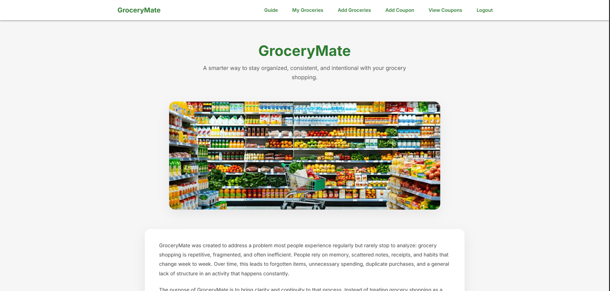
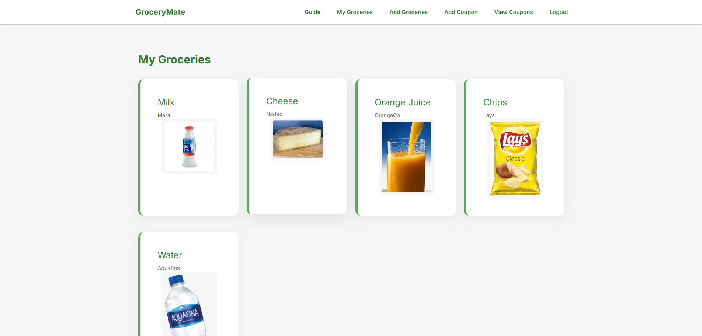
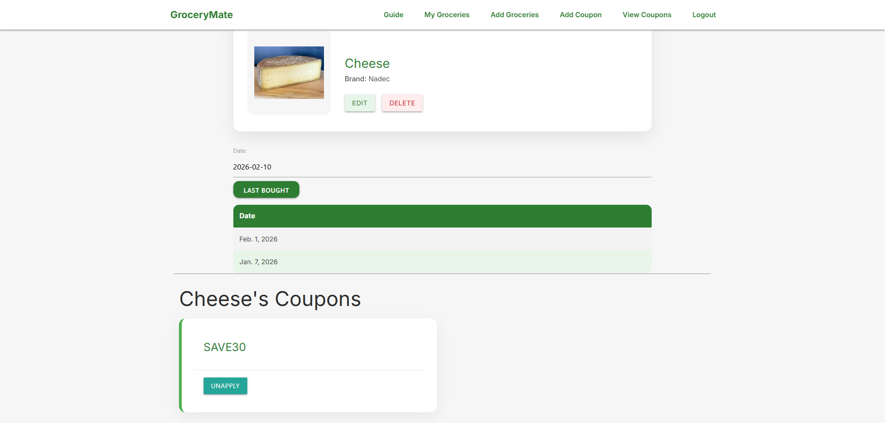

# GroceryMate
GroceryMate is a web-based grocery management application designed to help users organize grocery-related information through a structured and intuitive interface. The platform focuses on providing users with tools to manage groceries and coupons efficiently while maintaining a clean and consistent user experience across all pages.

The application is built using Django and leverages its authentication system to ensure that all user data remains private and secure. Each user interacts with their own set of groceries and coupons, allowing the platform to function as a personalized management system rather than a shared list.
# Website Preview

# ERD

# Wireframe

# Trello
https://trello.com/b/mLQicnwC/grocerymate

# Technologies used
* Python – Core programming language used for backend development

* Django – Web framework used to handle routing, views, models, and authentication

# Future Enhancements
* Add user profile customization options

* Implement category tagging for groceries and coupons

* Support multiple grocery lists per user
